  

 

I build the plumbing that data and AI agents run on: distributed pipelines, workflow engines that survive failure, and backends that keep many tenants apart. Senior data and AI engineer at **Experion Technologies**, based in Alappuzha, Kerala. When the builds are green, I paint.

### Running right now

- Distributed data pipelines, orchestration architectures and local-first AI tooling
- Microservices, event-driven backends and multi-tenant container orchestration
- Relational and graph data modeling, from PostgreSQL schemas to Neo4j knowledge graphs
- Writing on the blog about Python for data engineering

### Stack

### Shipped

  
  

### Activity

<!-- metrics.svg is generated by .github/workflows/metrics.yml; run it once after adding the METRICS_TOKEN secret -->

<!-- the snake is generated by .github/workflows/snake.yml into the "output" branch -->

### Connect

  
  
  

